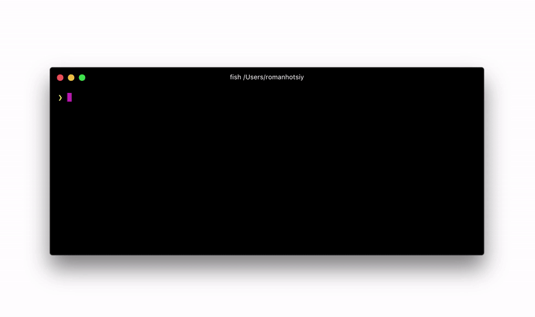
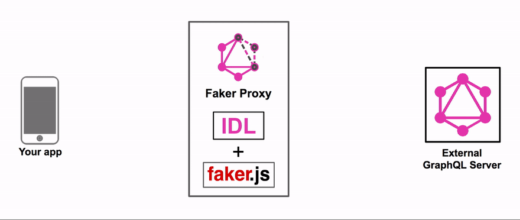

# GraphQL Faker
[](https://www.npmjs.com/package/graphql-faker) [](https://david-dm.org/APIs-guru/graphql-faker)
[](https://david-dm.org/APIs-guru/graphql-faker?type=dev)
[](https://github.com/APIs-guru/graphql-faker/blob/master/LICENSE)

Mock your future API or extend the existing API with realistic data from [faker.js](https://github.com/Marak/faker.js). __No coding required__.
All you need is to write [GraphQL IDL](https://www.graph.cool/docs/faq/graphql-schema-definition-idl-kr84dktnp0/). Don't worry, we will provide you with examples in our IDL editor.

In the GIF bellow we add fields to types inside real GitHub API and you can make queries from GraphiQL, Apollo, Relay, etc. and receive __real data mixed with mock data.__


## How does it work?
We use `@fake` directive to let you specify how to fake data. And if 60+ fakers is not enough for you, just use `@examples` directive to provide examples. Just add a directive to any field or custom scalar definition:

    type Person {
      name: String @fake(type: firstName)
      gender: String @examples(values: ["male", "female"])
    }

No need to remember or read any docs. Autocompletion is included!

## Features

+ 60+ different types of faked data e.g. `streetAddress`, `firstName`, `lastName`, `imageUrl`, `lorem`, `semver`
+ Comes with multiple locales supported
+ Runs as a local server (can be called from browser, cURL, your app, etc.)
+ Interactive editor with autocompletion for directives with GraphiQL embeded
+ ✨ Support for proxying existing GraphQL API and extending it with faked data


## Install

    npm install -g graphql-faker
or

    yarn global add graphql-faker


## TL;DR

Mock GraphQL API based on example IDL and open interactive editor:

    graphql-faker --open

__Note:__ You can specify non-existing IDL file names - Faker will use example IDL which you can edit in interactive editor.

Extend real data from SWAPI with faked data based on extension IDL:

    graphql-faker ./ext-swapi.grqphql --extend http://swapi.apis.guru

Extend real data from GitHub API with faked data based on extension IDL (you can get token [here](https://developer.github.com/early-access/graphql/guides/accessing-graphql/#generating-an-oauth-token)):

    graphql-faker ./ext-gh.graphql --extend https://api.github.com/graphql \
    --header "Authorization: bearer <TOKEN>"

## Usage

    graphql-faker [options] [IDL file]

`[IDL file]` - path to file with [IDL](https://www.graph.cool/docs/faq/graphql-schema-definition-idl-kr84dktnp0/). If this argument is omited Faker uses default file name.

### Options
 * `-p`, `--port`     HTTP Port [default: `9002`]
 * `-e`, `--extend`   URL to existing GraphQL server to extend
 * `-o`, `--open`     Open page with IDL editor and GraphiQL in browser
 * `-H`, `--header`   Specify headers to the proxied server in cURL format, e.g.: `Authorization: bearer XXXXXXXXX`
 * `--co`, `--cors-origin`   CORS: Specify the origin for the Access-Control-Allow-Origin header
 * `-h`, `--help`     Show help

# Development
```sh
npm install
npm run build:all
npm run start
```
